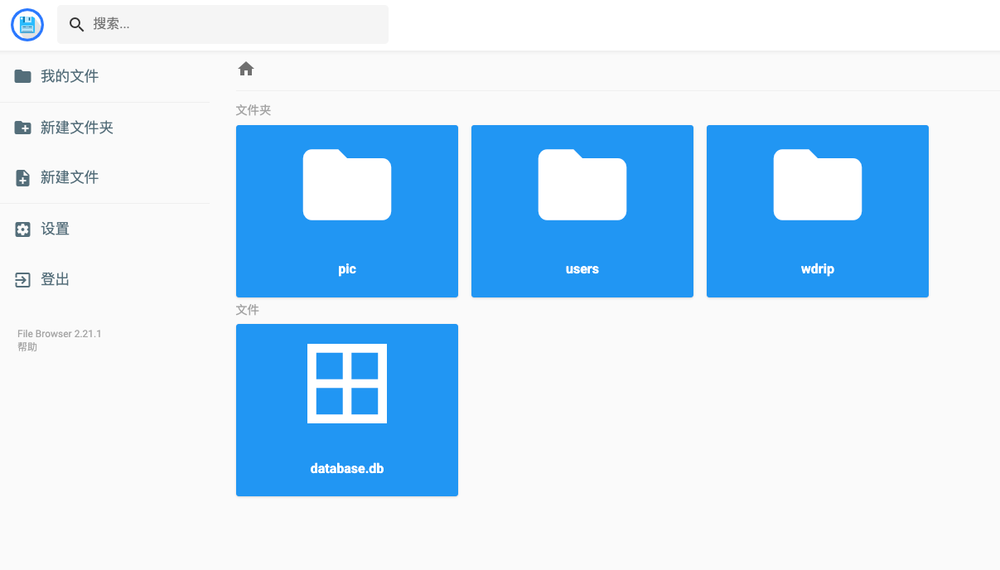

## Coming soon

### 示例应用一： 文件共享服务器
`filebrowser` 应用提供文件共享服务，存储使用阿里云OSS存储系统。因此需要配置阿里云ACCESS_KEY_ID和ACCESS_KEY_SEC与REGION。
请先git clone 代码到本地，安装filebrowser的脚本位于`hack/example/filebrowser.sh`
```shell
(base) ➜ export REGION=cn-hangzhou
(base) ➜ export ACCESS_KEY_ID=xxxx
(base) ➜ export ACCESS_KEY_SECRET=yyyyy
(base) ➜ export KUBECONFIG=~/.kube/config.wdrip
(base) ➜ bash hack/example/filebrowser.sh
(base) ➜ 
(base) ➜ kubectl get svc
NAME          TYPE           CLUSTER-IP     EXTERNAL-IP     PORT(S)        AGE
filebrowser   LoadBalancer   172.19.4.156   47.110.243.41   80:31295/TCP   22d
kubernetes    ClusterIP      172.19.0.1     <none>          443/TCP        22d

```
访问`http://47.110.243.41`开始玩转filebrowser. 初始密码admin/admin ? 记得改密码


等待10分钟后，wdrip会自动snapshot整个etcd配置。此时可以尝试带着应用场景测试wdrip的基础设施复原力。


### 示例应用二：wordpress

```shell
(base) ➜ export KUBECONFIG=~/.kube/config.wdrip
(base) ➜ bash hack/example/wordpress.sh
(base) ➜ 
(base) ➜ kubectl get svc
NAME          TYPE           CLUSTER-IP     EXTERNAL-IP     PORT(S)        AGE
filebrowser   LoadBalancer   172.19.4.157   47.110.243.30   80:31295/TCP   22d
kubernetes    ClusterIP      172.19.0.1     <none>          443/TCP        22d
```

访问`http://47.110.243.30`

### 示例应用三：蓝绿发布应用

```shell
(base) ➜ export KUBECONFIG=~/.kube/config.wdrip
(base) ➜ kubectl apply -f hack/example/blue.yml
(base) ➜ 
(base) ➜ kubectl get svc
NAME          TYPE           CLUSTER-IP     EXTERNAL-IP     PORT(S)        AGE
filebrowser   LoadBalancer   172.19.4.158   47.110.243.50   80:31295/TCP   22d
kubernetes    ClusterIP      172.19.0.1     <none>          443/TCP        22d
```
访问`http://47.110.243.50`
